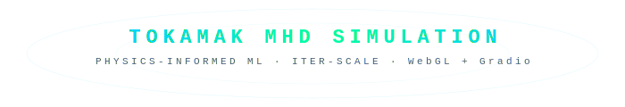

# ⚡ Tokamak MHD Fluid Simulation — PIML Fusion Reactor

<p align="center">
  
</p>

<p align="center">
  <a href="https://github.com/SiddharthMaverick/tokamak-piml/actions"></a>
  
  
  
  
</p>

A real-time **WebGL tokamak plasma simulation** embedded in a Gradio dashboard.  
Particle tracers follow magnetic field lines with correct rotational transform **ι = 1/q**, driven by real fusion-reactor operator inputs derived from ITER-scale physics.

---

## ✨ Features

| Feature | Details |
|---|---|
| **3D WebGL torus** | Three.js r128, 60 FPS, drag to orbit, scroll to zoom |
| **Real operator controls** | Ip, Bt, P_NBI, ne — not toy sliders |
| **Live physics derivation** | q, β_N, v_tor, δB/B computed per frame |
| **Disruption warning** | Kruskal-Shafranov alert when q < 2 |
| **Jet colourmap** | Radial temperature proxy: blue (cold edge) → red (hot core) |
| **Ballooning turbulence** | Field-aligned noise scaled by β_N/q² |
| **CI tested** | Physics unit tests run on Python 3.10/11/12 |

---

## 🚀 Quickstart

### Prerequisites
- Python 3.10 or newer
- A modern browser (Chrome / Firefox / Edge)

### 1 · Clone & install
```bash
git clone https://github.com/YOUR_USERNAME/tokamak-piml.git
cd tokamak-piml
python -m venv .venv
source .venv/bin/activate        # Windows: .venv\Scripts\activate
pip install -r requirements.txt
```

### 2 · Run locally
```bash
python app.py
# → open http://localhost:7860 in your browser
```

### 3 · Run on Colab / share publicly
```bash
# Edit the last line of app.py:
demo.launch(share=True)   # prints a gradio.live public URL
```

---

## 🎛️ Operator Controls

| Slider | Symbol | Range | Physics |
|---|---|---|---|
| Plasma current | Ip | 0.5 – 5.0 MA | Drives poloidal B field, sets q profile |
| Toroidal field | Bt | 1.0 – 8.0 T | Main confining field, raises q |
| NBI heating power | P_NBI | 0 – 100 MW | Neutral beam: drives rotation & β |
| Electron density | ne | 1.0 – 12.0 × 10¹⁹ m⁻³ | Collisionality, damps rotation |
| Tracers | N | 100 – 1200 | Visual particle count |

---

## 🔬 Physics Derivation

### Safety factor  q  (Kruskal-Shafranov approximation)
```
q ≈ a² · Bt / (R · μ₀ · Ip / 2π)
  → simplified to  q = k_q · Bt / Ip
```
Calibrated at ITER baseline (Ip = 2 MA, Bt = 3.5 T → q = 2.5).  
**Disruption risk when q < 2** (tearing modes, Kruskal-Shafranov criterion).

### Normalised beta  β_N  (Troyon proxy)
```
β_N ∝ P_NBI / (ne · Bt²)
```
Troyon stability limit: **β_N < 3.5** (%·m·T/MA).

### Toroidal rotation  v_tor
```
v_tor ∝ P_NBI / ne
```
NBI deposits toroidal momentum; collisional drag scales with ne.

### Turbulence  δB/B
```
δB/B ∝ β_N / q²    (ideal ballooning drive)
```
Zero at low β or high q; caps at 0.90 to keep simulation bounded.

### Particle advance per frame
```
Δθ = vel · speed_i          (toroidal step)
Δφ = Δθ / q                 (poloidal step, rotational transform ι = 1/q)
ρ → ρ + noise3(...) · δB/B  (radial turbulent perturbation)
```

---

## 📁 Project Structure

```
tokamak-piml/
├── app.py                    ← Gradio entry point
├── requirements.txt
├── README.md
│
├── src/
│   ├── __init__.py
│   ├── physics.py            ← Pure-Python physics kernel (testable)
│   ├── html_template.py      ← Three.js WebGL scene (CSS + JS + HTML)
│   └── css.py                ← Gradio app stylesheet
│
├── tests/
│   ├── __init__.py
│   └── test_physics.py       ← 25+ unit tests for physics module
│
├── notebooks/
│   └── physics_exploration.ipynb   ← Parameter sweep notebook
│
├── docs/
│   └── PHYSICS.md            ← Extended physics documentation
│
├── assets/
│   └── banner.svg
│
└── .github/
    └── workflows/
        └── ci.yml            ← GitHub Actions (Python 3.10/11/12)
```

---

## 🧪 Running Tests

```bash
pytest tests/ -v
```

The test suite covers:
- q calibration at the ITER operating point
- Monotonicity of q vs Bt and Ip
- β_N response to P_NBI, Bt, ne
- Clamping of turb and vel
- Edge-case inputs (sliders at min/max)
- Stability flag functions
- `math.isfinite` checks on all outputs

---

## 🛠️ VS Code Setup

Open the project folder in VS Code — the `.vscode/` config provides:

- **Run Tokamak App** — F5 to launch the Gradio server
- **Run Tests** — launches pytest in the integrated terminal
- Recommended extensions: Python, Pylint, Black Formatter

---

## 🔭 Extending the Project

### Add a new control (e.g., ECRH power)
1. Add slider HTML to `src/html_template.py` → `_HTML_BODY`
2. Add the binding to `_JS` → `bind('sECRH', ...)`
3. Update `derivedParams()` in `_JS` and `src/physics.py`
4. Add unit tests in `tests/test_physics.py`

### Connect real PIML predictions
Replace the analytic `derivedParams()` with a call to your trained
PINN/PIML model (e.g., via ONNX runtime or a local Flask microservice).
The physics module interface stays identical.

### Deploy on Hugging Face Spaces
```bash
# Create a Space (Gradio SDK), push this repo, done.
# HF Spaces auto-detects app.py and requirements.txt.
```

---

## 📖 References

1. Wesson, J. (2004). *Tokamaks* (3rd ed.). Oxford University Press.
2. Freidberg, J. P. (2007). *Plasma Physics and Fusion Energy*. Cambridge UP.
3. ITER Physics Basis, *Nucl. Fusion* **39** (1999) 2175–2249.
4. Troyon, F. et al. (1984). MHD limits to plasma confinement. *Plasma Phys.* **26** 209.
5. Kruskal, M. & Shafranov, V. (1958). Safety factor criterion. *Phys. Fluids* **1** 265.

---

## 📄 License

MIT — see [LICENSE](LICENSE) for details.
